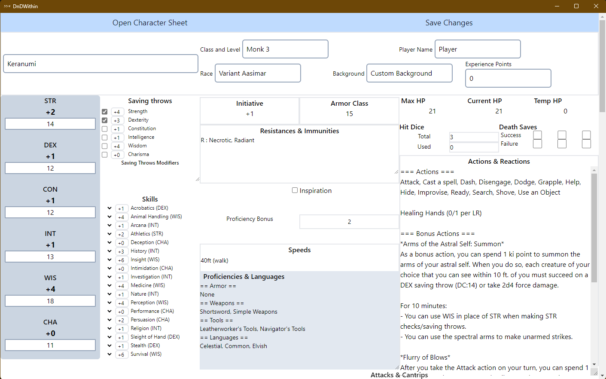

# DnD Within

*An editable digital character sheet for Dungeons & Dragons 5E.*

## What is this?

DnDWithin, commonly abridged as DDW, is a cross-platform, lightweight and entirely local desktop application to view, edit and save a 5th edition Dungeon&Dragons character sheet. It is meant as a replacement for your paper character sheet, and as an alternative to online tools such as D&DBeyond.

## Why use DDW?
| Feature                                    |  Physical sheet of paper   | DDW      | D&D Beyond |
| ------------------------------------------ |:--------------------------:|:--------:|:----------:|
| Can be used to play D&D                    |            Yes             | Yes      |    Yes     |
| Is stored locally                          |            Yes             | Yes      |     No     |
| Can be easily shared between people        |            Yes             | Yes      |     No     |
| Will not sell your infomation              |            Yes             | Yes      |     No     |
| Is free no matter how many sheets you make | Yes (+paper costs I guess) | Yes      |     No     |
| Is open-source                             |             X              | Yes      |     No     |
| Can be re-written over indefinitely        |             No             | Yes      |    Yes     |
| Auto-fills modifiers                       |             No             | Yes      |    Yes     |
| Auto-fills class features and traits       |             No             | Not yet  |    Yes     |
| Has tooltips for spells and items          |             No             | Not yet  |    Yes     |

## How to use DDW?
I recommand downloading the `example_character.json` file in this repository and loading it into DDW to see what is meant to go where!

### Downloading and Installing
Navigate to the ***Releases*** tab on the right of this page, and grab yourself the latest installer (an `.msi` file). Simply download it and execute it, saying yes to every prompt that might appear. You will then be able to find DnDWithin where you usually find your applications. 

### Character creation
At character creation, simply fill every field you want to use according to the character creation steps outlined in the Player's Handbook. Then when you're finished, click the "**Save Changes**" button and save your character sheet with a `.json` extension.

### During play
During play, you can simply edit the fields that need editing (HP, death saves, equipment, spell slots...). At the end of a session, save you changes using the same procedure as the first time you saved your character sheet - you can just save over the old version of the `.json` file if you aren't afraid of having no backup.

### How to share a character sheet
To share a sheet, simply share the desired `.json` file with your friends : every instance of DDW is able to open these.

## Something doesn't work!/Something isn't implemented!
Feel free to file an issue on github! This is just a hobby project so I can't guarantee that I'll be able to fix it quickly, but I'm sure that together we'll be able to make this software better one bug at a time!

### Usage Notes
 - Experience points have to be an integer number! If you're using milestone advancement, just leave it at whatever number tickles your fancy.
 - Added spells must be modified by modifiying the `.json` file in your favorite text editor, they're at the end of it. For now, this is the only way to delete/edit spells.

## How does this work?
For the curious among you, as you can see by looking at the code, this is a [tauri](https://tauri.app/) application, using [rust](https://www.rust-lang.org/) for its backend and [svelte](https://svelte.dev/) for its frontend.